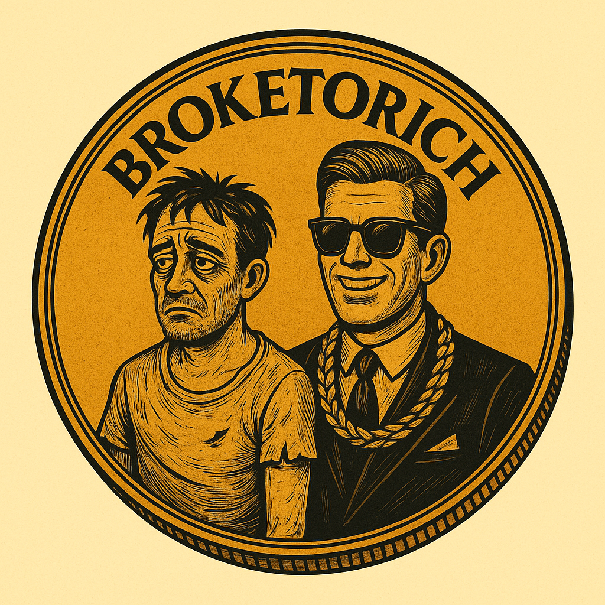

  

<h1 align="center">🪙 BrokeToRich (BTR)</h1>

  From Broke... to Rich 💸 | The Official Whitepaper Repository  

  <a href="https://broketorich.online"><strong>🌐 Visit Website</strong></a> •
  <a href="./BrokeToRich_Whitepaper.pdf"><strong>📄 Download Whitepaper (PDF)</strong></a> •
  <a href="https://t.me/BrokeToRichBSC"><strong>Telegram</strong></a> •
  <a href="https://x.com/BrokeToRichBNB"><strong>X (Twitter)</strong></a>

---

## 🔗 About BrokeToRich

**BrokeToRich (BTR)** is a decentralized token on Binance Smart Chain designed to fuel a mobile simulation game where players trade in-game digital assets — including houses, vehicles, clothes, and more — using BTR tokens. The project integrates DeFi, NFT commerce, and future DAO governance.

- **Token Supply:** 200,000,000 BTR  
- **Network:** Binance Smart Chain (BSC)  
- **Utility:** In-game economy & NFT marketplace  
- **Status:** Under development 🚧

---

## 📘 Whitepaper

📥 [Click here to download the official Whitepaper](./BrokeToRich_Whitepaper.pdf)

It includes everything about the project’s purpose, tokenomics, roadmap, governance, and in-game mechanics.

---

## 🗺️ Roadmap Highlights

- ✅ Website Launch  
- ✅ Token Deployment  
- 🚀 Game Beta Release (Upcoming)  
- 🛒 NFT & Item Marketplace  
- 🧠 DAO Governance System  
- 🤝 Strategic Partnerships & Listings

---

## 📲 Join the Community

Stay updated and get involved:

- 💬 [Telegram: BrokeToRichBSC](https://t.me/BrokeToRichBSC)  
- 🐦 [Twitter: @BrokeToRichBNB](https://x.com/BrokeToRichBNB)  
- 🌍 [Website: broketorich.online](https://broketorich.online)

---

> 🧠 Powered by the community.  
> From Broke... to Rich.

